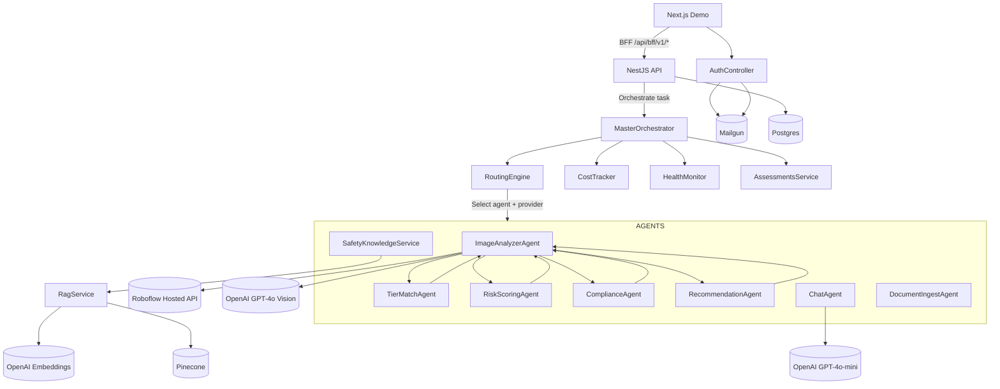
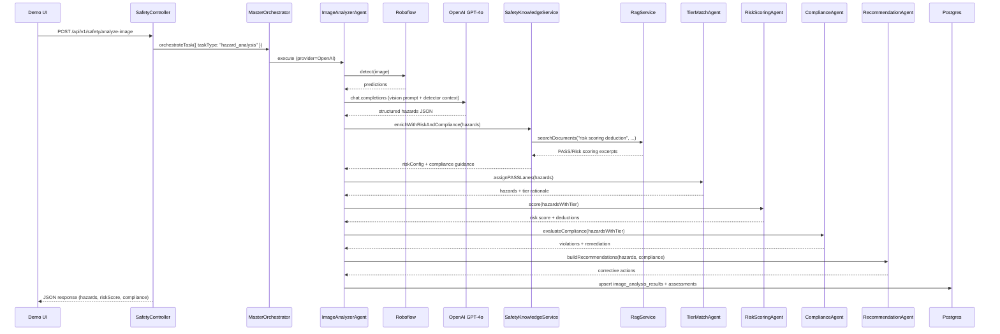

# PathFindR Agent & Orchestrator Architecture

_Last updated: 2025‑09‑25_

This guide catalogs the “agent” style components that power hazard detection, risk scoring, knowledge lookups, and chat inside the NestJS backend. It describes how the Master Orchestrator chooses providers, what each agent calls, and which third-party services are involved.

## Runtime Topology

## Master Orchestrator Overview

- **Entry Point**: `MasterOrchestrator.orchestrateTask(request)`
- **Provider Management**: `ProviderManager` initializes provider SDKs (OpenAI, Roboflow, Pinecone) on startup and exposes health metadata.
- **Routing**: `RoutingEngine` scores available `AgentType` + `ProviderType` combinations based on cost targets, latency history (from `HealthMonitor`), and user preferences.
- **Workflow Tracking**: The orchestrator records progress, cost, and provider fallbacks; it also notifies `AssessmentsService` when document lifecycles should move to `processing`/`ready`/`failed`.
- **Cost & Health**: `CostTracker` aggregates per-call pricing; `HealthMonitor` records provider latency/error rates, enabling automatic fallback if Roboflow or OpenAI fail.

Typical task types:

| Task Type | Routed Agent(s) | External Calls | Notes |
|-----------|-----------------|----------------|-------|
| `hazard_analysis` | `ImageAnalyzerAgent` + tier/risk/compliance/recommendation agents | Roboflow, OpenAI GPT‑4o, PASS/Risk via RAG | Assigns PASS tiers, scores risk, maps compliance, and writes enriched analysis payloads before updating `documentStatus`. |
| `risk_scoring_enrichment` | `SafetyKnowledgeService` | Pinecone, OpenAI embeddings (via RAG) | Pulls PASS/Risk Scoring docs to compute deductions and compliance rules. |
| `chat_message` | `ChatAgent` | OpenAI GPT‑4o-mini, Pinecone | Cited Ask-Guy replies; tokens tracked per session. |
| `rag_ingest` | `DocumentIngestAgent` | OpenAI embeddings, Pinecone | Parses and embeds uploaded PDFs/DOCX/TXT via `DocumentParserService`. |
| `email_invite` | `EmailService` | Mailgun | Triggered by `SecureAuthService` when whitelist registration is initiated. |

## Agent Inventory

| Component | Kind | Source | Third Parties | Description |
|-----------|------|--------|---------------|-------------|
| `ImageAnalyzerService` | Agent | `safety/services/image-analyzer.service.ts` | Roboflow, OpenAI GPT‑4o | Combines Roboflow bounding boxes with GPT‑4o JSON output; merges detections, calculates hazard metadata, persists analysis records. |
| `RoboflowDetectorService` | Provider Client | `safety/services/roboflow-detector.service.ts` | Roboflow Hosted API | Sends base64 frames to the configured model (`safety-hazard-identification/4`), normalizes geometry, reports latency. |
| `SafetyKnowledgeService` | Support Agent | `safety/services/safety-knowledge.service.ts` | OpenAI embeddings, Pinecone (via `RagService`), local PASS PDFs | Fetches Risk Scoring tables and PASS bullet lists through the RAG layer; generates compliance requirement maps and severity tiers. |
| `TierMatchingAgentService` | Agent | `safety/services/tier-matching-agent.service.ts` | (Depends on `SafetyKnowledgeService`) | Assigns PASS tier labels + rationale per hazard using PASS layer/component rules. |
| `RiskScoringAgentService` | Agent | `safety/services/risk-scoring-agent.service.ts` | (Depends on `SafetyKnowledgeService`) | Applies PASS deduction tables and severity multipliers to compute normalized risk scores with breakdown metadata. |
| `ComplianceAgentService` | Agent | `safety/services/compliance-agent.service.ts` | (Depends on `ComplianceService` + `SafetyKnowledgeService`) | Evaluates hazards against PASS, NFPA 101, OSHA 1910, ADA; returns remediation guidance with citations. |
| `RecommendationAgentService` | Agent | `safety/services/recommendation-agent.service.ts` | (Depends on `SafetyKnowledgeService`) | Generates cost/effort-aware corrective actions and links them to compliance codes and tiers. |
| `ComplianceService` | Support Agent | `safety/services/compliance.service.ts` | (Depends on `SafetyKnowledgeService`) | Underlying rules engine that the compliance agent uses to derive violations and deadlines. |
| `AssessmentsService` | Infrastructure | `assessments/assessments.service.ts` | Postgres | Synchronizes assessments/media, writes analysis updates, and mirrors state back to the PWA.
| `ChatService` | Agent | `chat/chat.service.ts` | OpenAI GPT‑4o-mini, Pinecone | Retrieves RAG context, calls OpenAI, saves messages with source metadata. |
| `RagService` | Support Agent | `rag/rag.service.ts` | OpenAI embeddings, Pinecone | Parses, embeds, and retrieves documents; shared by chat and safety knowledge. |
| `DocumentParserService` | Utility | `rag/services/document-parser.service.ts` | `pdf-parse`, `mammoth` (local libs) | Generates page-aware text chunks and metadata for ingestion. |
| `EmailService` | Agent | `auth/services/email.service.ts` | Mailgun, SMTP | Dispatches registration invites; falls back to file capture when third-party providers are disabled. |

## Hazard Analysis Sequence

## Chat / RAG Flow

1. `ChatController` receives a message and creates a session if needed.
2. `MasterOrchestrator` routes a `chat_message` task to `ChatService` with OpenAI GPT‑4o-mini as the provider.
3. `ChatService` embeds the query (OpenAI embeddings) and queries Pinecone through `RagService`.
4. Retrieved chunks (with filenames, pages) are injected as citations into the OpenAI prompt.
5. The assistant reply, sources, and session metadata persist to Postgres so the UI can reload conversations offline.

## Email Invite Flow

1. `SecureAuthService.initiateRegistration` confirms the requester is in `email_whitelist` and rate-limit thresholds allow another invite.
2. A registration token is created via `TokenService` and stored in Postgres.
3. `EmailService.sendRegistrationEmail` is invoked. If `EMAIL_SERVICE=mailgun` and credentials are present, nodemailer uses the Mailgun transport to send the message; otherwise the email is written to `src/pathfinder-api-demo/logs/` for manual inspection.
4. Delivery status is logged with correlation IDs to help trace issues across Railway.

## Operational Notes

- **Fallbacks** – If Roboflow or OpenAI Vision fail, the orchestrator can choose an alternate provider (when configured) or surface an error while preserving the workflow log.
- **Cost Tracking** – Every external call reports tokens/cost (`CostTracker.recordCost`) so per-assessment pricing can be audited.
- **Health Monitoring** – Provider health metrics feed routing decisions; high error rates cause the orchestrator to downgrade providers until they recover.
- **Document Status Hooks** – When hazard analysis runs, assessments are marked `processing`; once hazards are saved the orchestrator sets status `ready` or `failed`, which the PWA reads during hydration.

Use this document whenever you add a new provider, adjust task routing, or need to trace which service calls an external API.

## Agent Kind Glossary

- **Agent** – Owns a focused workflow and may call external providers or other support services. Agents usually appear in orchestrator routing decisions (e.g., `RiskScoringAgentService`, `ChatService`).
- **Support Agent** – Provides domain data or utility logic that other agents rely on but is not routed directly by the orchestrator (e.g., `SafetyKnowledgeService`, `ComplianceService`).
- **Provider Client** – Thin wrapper around a third-party SDK that standardizes auth, error handling, and telemetry (e.g., `RoboflowDetectorService`, `PineconeService`).

### Invocation Notes

- **ChatAgent** – Invoked by `ChatController` through `ChatService.sendMessage`, which routes `chat_message` tasks to the orchestrator so conversations can retrieve RAG context and call OpenAI GPT‑4o-mini.
- **DocumentIngestAgent** – Triggered by the RAG HTTP surface (`RagController`), covering upload, reprocess, and delete flows. The controller forwards work to the orchestrator as `rag_ingest` tasks, which the agent fulfills by parsing, embedding, and upserting documents.
