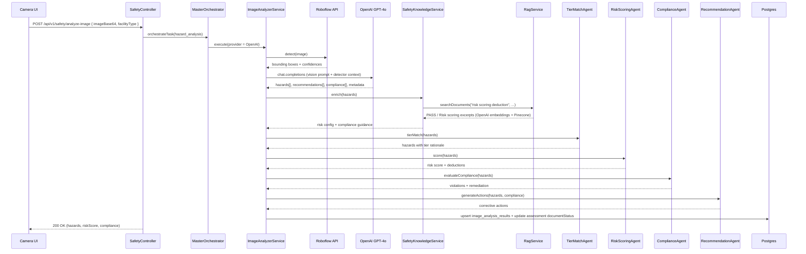

# Image Analysis Pipeline (Camera → Hazard Payload)

This doc tracks the exact steps taken when an operator captures an image in the demo application. It highlights where data is stored, which internal services are involved, and when third-party providers are invoked.

## 1. Capture & Staging (Frontend)

1. The camera page (`/camera`) immediately creates a remote assessment via `assessmentService.createAssessment` (`POST /api/v1/assessments`). The response is mirrored into IndexedDB so the session works offline.
2. Each capture stores an in-memory blob and records metadata (width, height, device info). `mediaService.addMultipleMedia` keeps the staged images in Dexie until they are compressed and uploaded.
3. When the operator taps **Analyze**, `aiAnalysisService.analyzeImage` posts the primary image (base64) to the API through the BFF route `/api/auth/analyze` → `/api/v1/safety/analyze-image`.

## 2. Orchestrated Hazard Analysis (Backend)

### Details

- **Roboflow**: `RoboflowDetectorService` posts the image to `https://serverless.roboflow.com/safety-hazard-identification/4` and returns normalized bounding boxes with confidences and source metadata.
- **OpenAI GPT‑4o**: `ImageAnalyzerService` sends a JSON-enforced prompt containing context (facility type, Roboflow hits, prior hazards). The response includes narrative analysis, hazards with severity tiers, remediation, and optional compliance suggestions.
- **Safety Knowledge**: `SafetyKnowledgeService` pulls PASS guidelines and the “Risk Scoring Review” document via `RagService`. RAG first attempts Pinecone (`text-embedding-3-small`) and falls back to on-disk PDFs if retrieval fails.
- **Risk Scoring & Compliance**:
  - `TierMatchingAgentService` assigns PASS tier labels and rationale to each hazard so downstream agents understand criticality.
  - `RiskScoringAgentService` applies PASS deduction tables and severity multipliers to derive the normalized `riskScore` with a per-hazard breakdown.
  - `ComplianceAgentService` maps hazards to PASS/NFPA/OSHA/ADA references and returns remediation language plus severity.
  - `RecommendationAgentService` converts the hazard + compliance context into cost/effort-aware corrective actions that flow back to the UI.
- **Persistence**: The analysis payload is stored in `image_analysis_results` (JSONB) and the parent assessment is patched with risk score, hazard count, document status (`ready` or `failed`), and analysis summary.

## 3. Media & Assessment Sync

1. `assessmentService.updateAssessment` patches the remote assessment with new media IDs and analysis metadata. The API consolidates them in Postgres.
2. `SyncService` (frontend) listens for queue flushes and `online` events. After the hazard analysis completes, it calls `hydrateFromServer()` so Dexie mirrors the authoritative data.
3. `mediaService.getAssessmentMediaUrls` now hydrates from Dexie first; if the local cache is empty it fetches `/api/v1/assessments/{remoteId}/media` and stores the links + blobs for offline review.

## 4. Review Experience (Frontend)

- `/analysis/[id]` hydrates from the API before falling back to Dexie, ensuring the risk score, document status, and hazard list reflect the server truth.
- Hazards render via `ImageViewer` overlays. Bounding boxes track the zoom/pan transform produced by `react-zoom-pan-pinch` so annotations stay aligned.
- Operators can accept/dismiss hazards, re-run analysis, export JSON, or share reports; actions queue locally if offline and replay when online.

## 5. Third-Party Summary

| Service | When Called | Responsible Module |
|---------|-------------|---------------------|
| **Roboflow Hosted API** | Immediately after the orchestrator starts a `hazard_analysis` task | `RoboflowDetectorService` |
| **OpenAI GPT‑4o (Vision)** | After Roboflow returns detections; used to generate structured hazard JSON | `ImageAnalyzerService` |
| **OpenAI GPT‑4o-mini** | Not part of this pipeline; used later by chat/report review when operators ask questions | `ChatService` |
| **OpenAI Embeddings (`text-embedding-3-small`)** | During safety knowledge lookups and RAG search | `RagService` |
| **Pinecone** | Vector search for PASS/Risk Scoring documents that inform risk deductions and compliance matching | `RagService` |
| **Mailgun** | Only for onboarding email flows; unrelated to image analysis but part of the end-to-end assessment lifecycle | `EmailService` |

## Key Source Files

- `src/pathfinder-api-demo/src/safety/safety.controller.ts`
- `src/pathfinder-api-demo/src/orchestrator/master-orchestrator.service.ts`
- `src/pathfinder-api-demo/src/safety/services/image-analyzer.service.ts`
- `src/pathfinder-api-demo/src/safety/services/roboflow-detector.service.ts`
- `src/pathfinder-api-demo/src/safety/services/safety-knowledge.service.ts`
- `src/pathfinder-api-demo/src/assessments/assessments.service.ts`
- `src/pathfinder-demo/app/camera/page.tsx`
- `src/pathfinder-demo/lib/services/ai-analysis-service.ts`
- `src/pathfinder-demo/lib/services/assessment-service.ts`

Keep this document in sync when the orchestrator gains new providers, when the safety knowledge base changes, or when frontend capture flows evolve.
