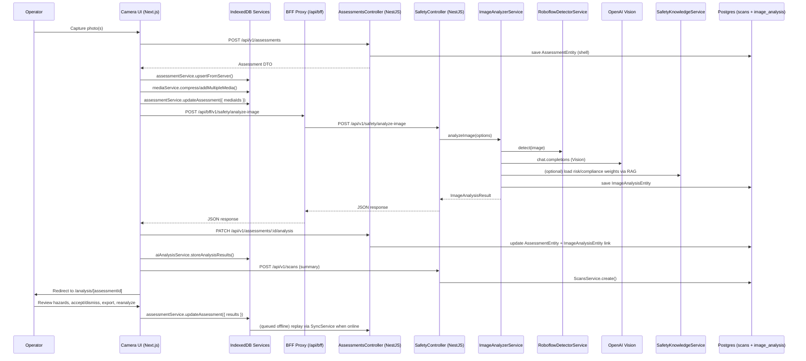

# PathFindR Image Scan Workflow

This document maps the end‑to‑end sequence for analyzing a facility image, from capture in the demo UI through AI inferencing, scoring/compliance enrichment, dashboard aggregation, and report export. It enumerates every agent and service involved so engineers can quickly locate integration points or extend the flow.

## High-Level Phases

1. **Capture & Staging (Frontend → API)** – Camera UI immediately creates a remote assessment via `assessmentService` (queued offline when needed), mirrors that shell into IndexedDB, and persists captured media/metadata locally while showing progress.
2. **AI Analysis Request (Frontend → API)** – `aiAnalysisService` posts the primary image to the Safety API through the BFF proxy, handles auth, and streams status updates to the UI.
3. **Hazard Detection & Scoring (Backend)** – `SafetyController` orchestrates `ImageAnalyzerService`, `RoboflowDetectorService`, OpenAI Vision, and optional RAG-backed scoring/compliance helpers before persisting the canonical result.
4. **Server Persistence & Hydration (API ↔ Frontend)** – Analysis payloads are patched into the assessment via the API, then mirrored to IndexedDB. `SyncService` hydrates from the server after queue flushes so local caches and risk badges stay aligned.
5. **Presentation & Review (Frontend)** – The analysis detail page hydrates from the API first (falling back to Dexie offline), renders hazards, compliance items, recommendations, and quick actions (share, export, reanalyze, accept/dismiss hazards).
6. **Reporting** – Users can export structured JSON directly; longer term this is where PDF/Doc generation hooks into the stored assessment + media.

## Sequence Diagram

## Component Responsibilities

| Layer | Component | Key Responsibilities |
| --- | --- | --- |
| UI | `/camera` page | Capture images, manage progress states, trigger analyze/save flows, redirect to analysis view. |
| UI Services | `assessmentService`, `mediaService`, `aiAnalysisService`, `syncService` | Create/patch assessments through the API, mirror data to IndexedDB, compress blobs, call Safety API, queue sync tasks, post `/scans` summaries. |
| UI Pages | `/analysis/[id]` | Render results, persist hazard accept/dismiss/reset, expose share/export/reanalyze actions. |
| BFF | `/api/bff/[...path]` | Normalize frontend requests onto the versioned backend API, forward headers, stream responses. |
| Safety API | `SafetyController` | Entry point for analysis/compliance/assessment routes, logging, auth enforcement. |
| Safety API | `ImageAnalyzerService` | Prompt engineering, Roboflow detection, OpenAI Vision call, geometry normalization, persistence to `image_analysis_results`. |
| Safety API | `RoboflowDetectorService` | Optional computer-vision pre-processor that returns normalized detections + latency metrics. |
| Safety API | `SafetyKnowledgeService` + `SafetyAssessmentService` | Load PASS/Risk RAG excerpts, derive tier deductions + hazard severity when assessments/compliance flows request them. |
| Safety API | `ComplianceService` | Map hazards to PASS/NFPA/OSHA/ADA requirements using `SafetyKnowledgeService` output. |
| Safety API | `ScansController/ScansService` | Persist scan summaries used by the dashboard counts (`scans` table). |
| External | OpenAI Vision | Multimodal reasoning for hazards/mitigations/compliance narratives. |
| External | Roboflow Hosted API | Object detection geometry/labels feeding the prompt context. |
| RAG Pipeline | `RagService`, `PineconeService`, `DocumentRepository` | Provide PASS + risk-scoring source material when knowledge service loads weights or compliance snippets. |
| Storage | IndexedDB (frontend) | Offline mirror for assessments/media plus the sync queue; hydrated from the API on boot/online events. |
| Storage | Postgres (backend) | Canonical store for assessments, image analyses, scan summaries, auth, etc. |

## Detailed Flow by Stage

1. **Capture & Staging**
   - The camera page opens a live video feed, allows zoom/focus/grid controls, and stores each snapped frame via `mediaService`. Metadata (device info, timestamps) is attached before compression.
   - An `assessment` shell row is created via the API (falling back to the Dexie queue when offline) so subsequent analysis/reanalysis is linked to a stable remote ID and document status updates stay authoritative.

2. **Initiating AI Analysis**
   - Clicking *Analyze* calls `aiAnalysisService.analyzeImage`. The service strips the base64 prefix, attaches correlation IDs, and posts to `/api/bff/v1/safety/analyze-image` so auth headers and correlation IDs are forwarded consistently.
   - The UI tracks staged progress (create assessment → upload → analyze → process results) and shows status animations while awaiting the backend response.

3. **Backend Hazard Orchestration**
   - `SafetyController` (NestJS) logs the request and delegates to `ImageAnalyzerService`.
   - `ImageAnalyzerService` optionally invokes `RoboflowDetectorService` for precise bounding boxes, then builds a system prompt + user instruction for OpenAI Vision (`response_format: json_object`).
   - After parsing/normalizing the LLM response, the service merges Roboflow geometry, calculates derived metrics, and persists an `ImageAnalysisEntity` row for auditing.
   - When explicit risk/compliance enrichment is requested (e.g., via other safety endpoints), `SafetyKnowledgeService` pulls PASS/Risk-Scoring docs through `RagService`, and `SafetyAssessmentService` / `ComplianceService` apply the retrieved weights/requirements.

4. **Local Result Persistence & Sync**
   - The client receives the JSON payload, calls `assessmentService.addAnalysisResults` to persist hazards/risk/compliance back to the API, then mirrors the server response into Dexie so offline review shows the same document status and metrics.
   - A convenience scan summary is posted to `/api/v1/scans`, ensuring the home dashboard’s totals and “Recent scans” list reflect the new analysis without waiting for background sync.
   - When offline, these PATCH requests land in the sync queue; `SyncService.processSyncQueue()` replays them on reconnect and rehydrates Dexie afterwards.

5. **Analysis Review & Editing**
   - `/analysis/[id]` hydrates from the API first, falling back to the Dexie mirror when offline, and renders risk gauges, hazard cards (with accept/dismiss/reset), compliance callouts, and media overlays.
   - *Reanalyze* now reloads the primary media blob, re-calls `aiAnalysisService.analyzeImage`, reinserts the latest results, and surfaces success/failure toasts.
   - *Share* leverages `navigator.share` when available or falls back to clipboard copy; *Export Report* downloads a JSON bundle containing the assessment metadata, hazards, recommendations, and compliance findings.

6. **Reporting & Future Hooks**
   - The exported JSON is intended as the source for PDF/doc generators. A future report builder can reuse the same data payload (plus media URLs) to compile branded deliverables without calling the AI stack again.

## Extending the Workflow

- **Additional Agents** – New validators (e.g., geometry QA, secondary model cross-checks) slot in after `RoboflowDetectorService` but before the OpenAI response is persisted.
- **Asynchronous Processing** – For heavier workloads, replace the direct call in `SafetyController` with a queue dispatch; clients can poll `/analysis/:id/progress` using the existing `aiAnalysisService.getAnalysisProgress` helper.
- **Report Generation** – A server-side report worker can subscribe to scan completion events, fetch the saved `ImageAnalysisEntity` + associated documents, and render PDFs stored back to Postgres or object storage.
- **Sync Pipeline** – `syncService` already batches IndexedDB changes for eventual cloud reconciliation; any new tables/endpoints should expose `/api/sync/*` handlers mirrored by Dexie queue processors.

This workflow doc should remain the canonical reference whenever new buttons appear on the analysis page or the backend adds surveillance/compliance agents—update it alongside any changes to prompts, document requirements, or reporting outputs.
