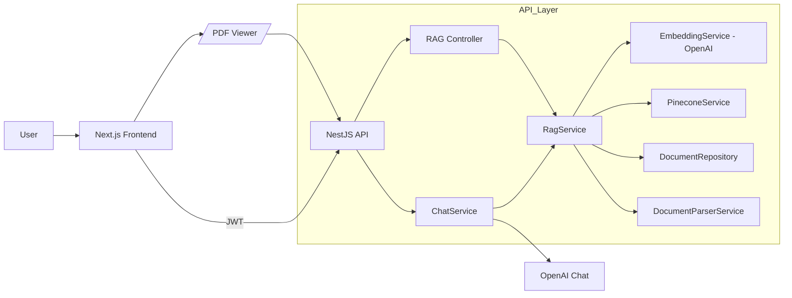
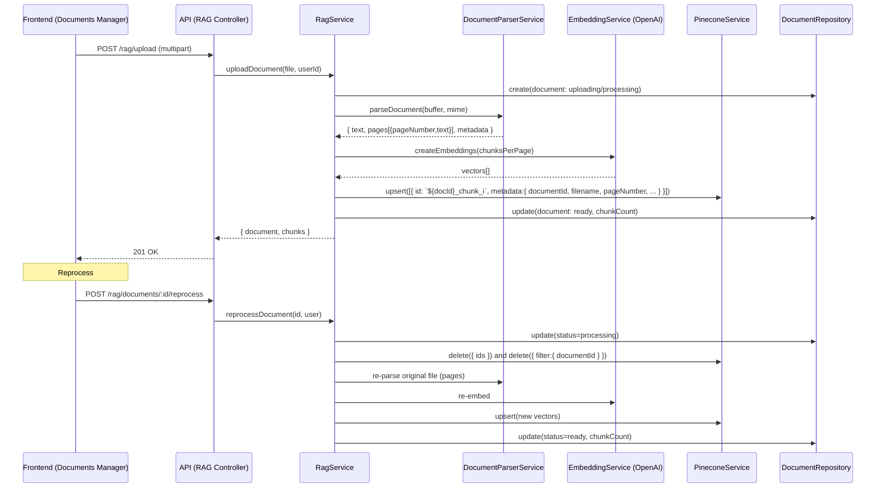
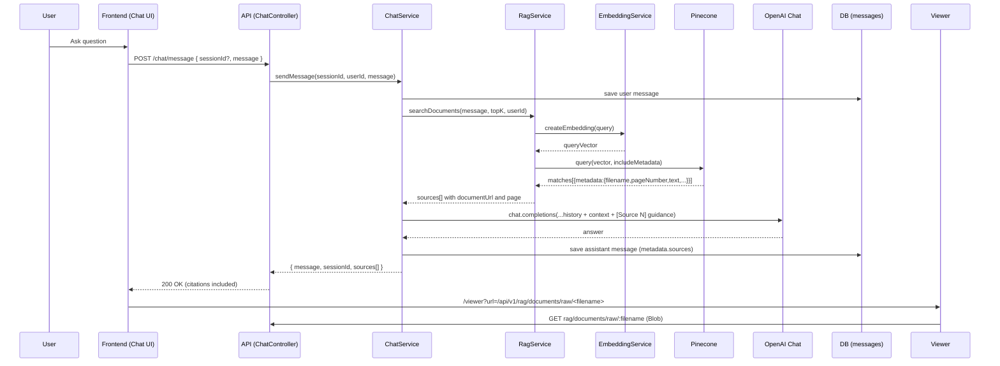
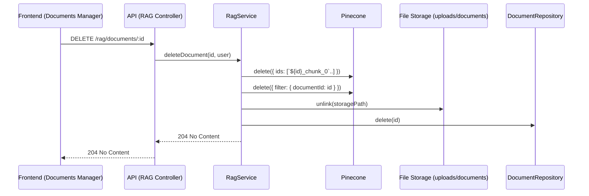

# PathFindR RAG Architecture

This document explains how Retrieval-Augmented Generation (RAG) is implemented in PathFindR, including the major services, data flows, runtime dependencies, and how citations and document viewing work. Diagrams are provided using Mermaid.

## Overview

- Backend: NestJS service in `src/pathfinder-api-demo` implements upload, parse, embed, vector store, retrieval, and safety knowledge lookups.
- Assessments: The safety pipeline uses RAG-backed PASS / Risk Scoring documents to compute deductions and compliance language before writing results to `assessments` + `image_analysis_results`. Postgres is therefore the canonical source the PWA hydrates on boot and after offline queues flush.
- Vector DB: Pinecone used for semantic search and storage of chunk vectors.
- Embeddings + LLM: OpenAI for embeddings (`text-embedding-3-small` by default) and chat completions.
- Frontend: Next.js app in `src/pathfinder-demo` handles uploads (dev UI), chat UI, citations display, and document viewing with page anchors.

## Key Services and Responsibilities

- RagService (`src/pathfinder-api-demo/src/rag/rag.service.ts`)
  - Upload pipeline: file persistence, parsing (page-aware), chunking, embeddings, vector upsert, DB status updates.
  - Search pipeline: query embedding, Pinecone query, relevance normalization, excerpt extraction, page-aware source assembly.
  - Reprocess/Delete: re-parse + re-embed (reprocess), remove vectors and DB/file (delete).

- EmbeddingService (`src/pathfinder-api-demo/src/rag/services/embedding.service.ts`)
  - OpenAI embeddings client, token/char-based chunking helpers with optional overlap, page-aware chunk support.

- PineconeService (`src/pathfinder-api-demo/src/rag/services/pinecone.service.ts`)
  - Initializes and connects to a Pinecone index (creates if missing at API startup).
  - Upsert/query/delete by IDs or metadata filter.

- DocumentParserService (`src/pathfinder-api-demo/src/rag/services/document-parser.service.ts`)
  - Parses PDFs (pdf-lib + pdf-parse), DOCX (mammoth), TXT/MD, returns `pages[]` with `pageNumber` and text.

- DocumentRepository (`src/pathfinder-api-demo/src/rag/repositories/document.repository.ts`)
  - DB persistence for documents, advanced filters, stats.

- ChatService (`src/pathfinder-api-demo/src/chat/chat.service.ts`)
  - Retrieves RAG context via RagService, composes prompt with conversation history, calls OpenAI chat, persists messages.
  - Persists assistant `metadata.sources` so citations survive reload; returns `sources[]` to the demo UI.
- SafetyKnowledgeService (`src/pathfinder-api-demo/src/safety/services/safety-knowledge.service.ts`)
  - Uses RagService to fetch PASS bullet lists and the “Risk Scoring Review” reference so tier matching, risk scoring, compliance checks, and recommendations always reflect the current documents.
  - Falls back to bundled PDFs only if RAG search fails.

## Upload/Re-Embed Pipeline

## Query/Retrieve/Answer Pipeline (Citations)

## Delete Pipeline (Per-Document)

## Data Model (Simplified)

- documents (typeorm entity `Document`)
  - id, filename, title, mimeType, size, metadata{ originalFilename, storagePath, ... }
  - vectorId, chunkCount, status: uploading|processing|ready|failed, errorMessage

- chat_sessions, chat_messages
  - chat_messages: id, sessionId, role, content, metadata (includes `sources[]` for assistant), documentIds (simple-array)

## API Surface (RAG-related)

- POST `/api/v1/rag/upload` (multipart `file`)
- GET `/api/v1/rag/documents` (list)
- GET `/api/v1/rag/documents/stats`
- POST `/api/v1/rag/documents/:id/reprocess`
- DELETE `/api/v1/rag/documents/:id`
- GET `/api/v1/rag/documents/raw/:filename` (PDF blob for viewer)

Chat:
- POST `/api/v1/chat/message`
- GET `/api/v1/chat/sessions`
- GET `/api/v1/chat/history/:sessionId`
- DELETE `/api/v1/chat/sessions/:sessionId`
- POST `/api/v1/chat/sessions`

## Frontend Integration Highlights

- Chat sources render under assistant messages with clickable page badges; links route to `/viewer?url=/api/v1/rag/documents/raw/<filename>#page=N`.
- The viewer fetches the PDF as a Blob via the Next axios client (with JWT) and preserves `#page=N` to open at the correct page.
- Deleting documents confirms and removes vectors from Pinecone and DB; Reprocess shows status=processing and auto-refreshes until ready.
- Assessment detail pages now hydrate their server-backed records (risk score, document status, hazard payload) before falling back to Dexie, so RAG citations and compliance badges always reflect the canonical backend state even after offline work. Offline edits queue in Dexie and replay through the API once connectivity returns, at which point the pages re-run hydration.

## Configuration & Ops

- Important env (backend): `OPENAI_API_KEY`, `OPENAI_MODEL`, `OPENAI_EMBEDDING_MODEL`, `PINECONE_API_KEY`, `PINECONE_INDEX`, `CORS_ORIGIN`.
- Important env (demo): `NEXT_PUBLIC_API_URL`.
- Index lifecycle: API creates Pinecone index on startup if missing. If an index is deleted manually, restart the API to recreate it, then reprocess or re-upload documents.

## Third-Party Summary

| Service | How it is used | Called from |
|---------|----------------|-------------|
| **OpenAI `text-embedding-3-small`** | Generates embeddings for new documents and query vectors during search. | `EmbeddingService` via `RagService` |
| **Pinecone** | Stores and queries chunk vectors with document + page metadata. | `PineconeService` |
| **OpenAI GPT‑4o-mini** | Produces cited chat answers using RAG sources. | `ChatService` |
| **Safety Knowledge Consumers** | SafetyKnowledgeService requests PASS/Risk Scoring chunks through `RagService` to feed tier matching, risk scoring, compliance, and recommendation agents. | `SafetyKnowledgeService`, downstream safety agents |

## Error Handling & Fallbacks

- If RAG search fails and `DEMO_MODE=true`, backend can synthesize fallback sources from recent docs; otherwise it returns clear unavailability messages.
- Assistant messages always persist `metadata.sources` so reopening a session shows the same citations.

## Notes & Recommendations

- Prefer per-document delete (via API/UI) over deleting the entire Pinecone index; this keeps DB, files, and vectors consistent.
- Use Reprocess after re-uploads or parser changes to ensure page-aware embeddings and precise citations.

## Diagrams

- Interactive diagrams live under `diagrams/` (`diagrams/index.html`, system/agents/RAG/context pages).
- To export images, use your browser’s screenshot tools or Mermaid CLI (`mmdc`); see `diagrams/README.md` for details.

## Providers & Models

- Embeddings: OpenAI `text-embedding-3-small` (default) for speed/cost balance.
- Chat/Answering: OpenAI GPT-4o/GPT-4 Turbo family for RAG answers and report text.
- Vision (planned/optional): Google Gemini Vision for fast per-frame analysis; OpenAI Vision for high-accuracy stills.
- Model routing: Use cheaper/fast models for pre-screening; promote to higher‑accuracy models when needed.

## Prompt Templates (Summary)

- Safety analysis system prompt focuses on K‑12 hazards: trip/fall, fire, electrical, structural, accessibility, security.
- Compliance prompt references NFPA 101, OSHA, ADA, and local codes for status and required actions.
- Prompts live in code alongside ChatService and Safety modules; they should return structured JSON when appropriate.

## Performance & Cost

- Retry with exponential backoff on provider errors; fall back to a secondary provider if available.
- Cache recent RAG results and AI responses where safe; invalidate on document changes.
- Batch vector ops (upsert/delete) and throttle RAG queries under load.
- Track per‑request duration, token usage, and a simple estimated cost metric for tuning.

## Live Streaming (Planned)

- Frame sampling: analyze every Nth frame to balance quality and latency.
- Provider: favor Gemini for faster multimodal streaming; track hazards across frames.
- Alerts: emit UI notifications when new hazards are detected; maintain a tracked hazard set.
- Multi‑modal: optionally incorporate audio transcripts to refine scene understanding.

## Risk Scoring (PASS)

- Reference “Scoring System V.02.pdf” for PASS‑style scoring; keep this document indexed for citations.
- Derive a base score (e.g., 100) and apply deductions weighted by hazard severity and confidence.
- Present score, grade, risk level, and a breakdown per hazard; include remediation suggestions.

## Deduplication (Planned)

- Geospatial heuristic: flag potential duplicates when assessments occur within a small radius and time window.
- Similarity checks: compare perceptual image hashes and hazard sets to identify probable duplicates.

## Testing & Monitoring

- Tests: validate hazard detection output shape and citation relevance; include RAG retrieval quality checks.
- Metrics: log model name, processing time, hazard count, average confidence, and relevance scores for RAG.
- Dashboards: track error rates, retry counts, and latency percentiles to inform model and index tuning.
